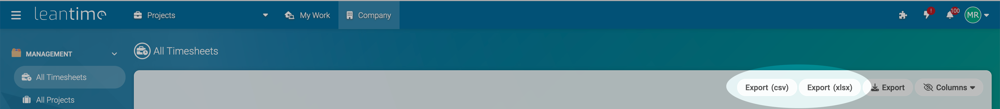

# Data export

Data export plugin for Leantime

## Installation

Download a release from
<https://github.com/ITK-Leantime/leantime-dataexport/releases> and extract into
your Leantime `Plugins` folder, e.g.

``` shell
curl --silent --location https://github.com/ITK-Leantime/leantime-dataexport/releases/download/0.0.2/leantime-dataexport-0.0.2.tar.gz | tar xv
```

Install and enable the plugin:

``` shell
bin/leantime plugin:install leantime/dataexport --no-interaction
bin/leantime plugin:enable leantime/dataexport --no-interaction
```

Go to `/timesheets/showAll` and enjoy your new exports:



## Development

Clone this repository into your Leantime plugin folder:

``` shell
git clone https://github.com/itk-leantime/leantime-dataexport app/Plugins/DataExport
```

Install plugin dependencies:

``` shell
cd app/Plugins/DataExport
docker run --tty --interactive --rm --env COMPOSER=composer-plugin.json --volume ${PWD}:/app itkdev/php8.1-fpm:latest composer install --no-dev
```

Install and enable the plugin:

``` shell
bin/leantime plugin:install leantime/dataexport --no-interaction
bin/leantime plugin:enable leantime/dataexport --no-interaction
```

### Coding standards

``` shell
docker run --tty --interactive --rm --env COMPOSER=composer-plugin.json --volume ${PWD}:/app itkdev/php8.1-fpm:latest composer install
docker run --tty --interactive --rm --env COMPOSER=composer-plugin.json --volume ${PWD}:/app itkdev/php8.1-fpm:latest composer coding-standards-check
```
